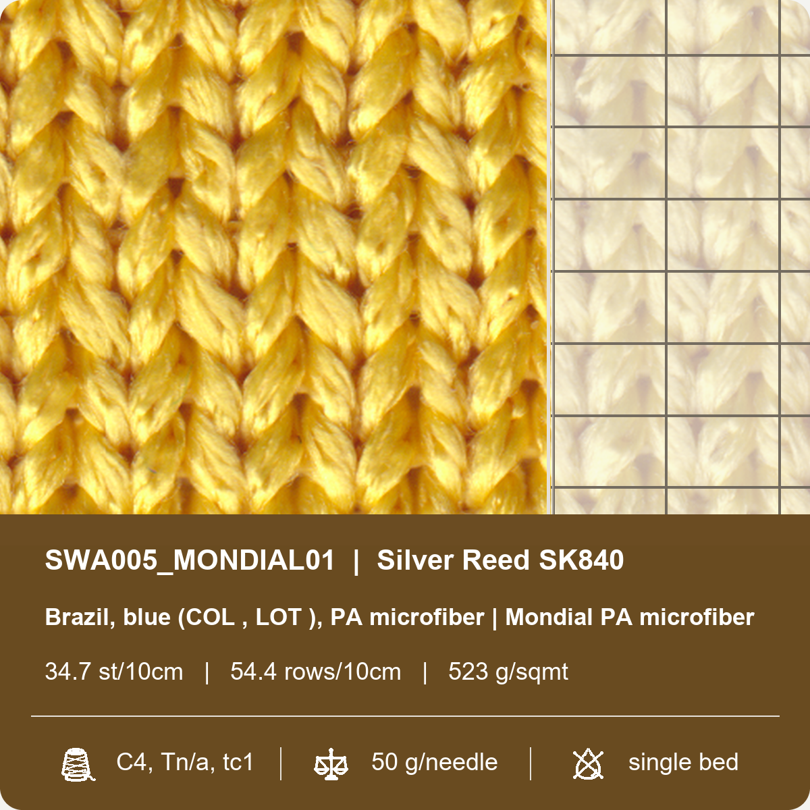
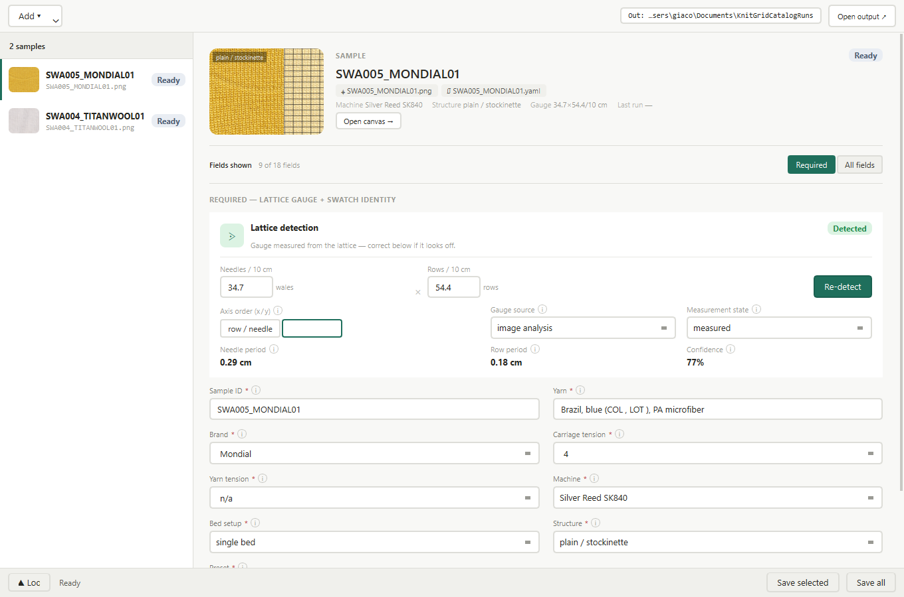
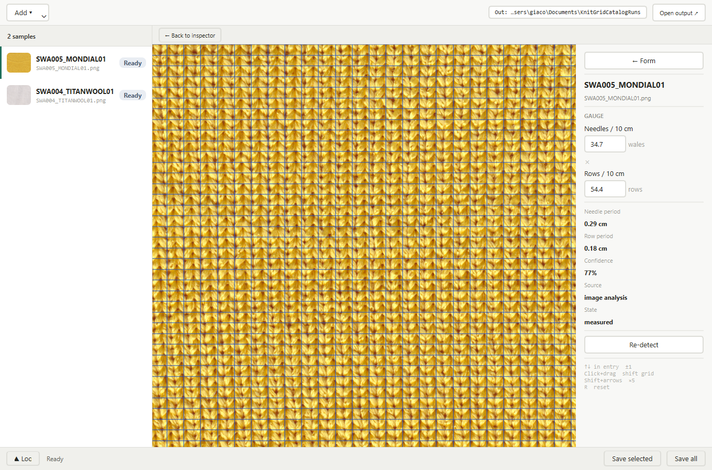

# Knit Grid Catalog Delivery

Knit Grid Catalog Delivery is a local desktop workflow for turning knit swatch
scans and sidecar metadata into catalog-ready TIFF assets.

It addresses a very practical production pain: knit swatch scans are visually
rich, but catalog delivery needs repeatable physical measurements. Operators
need to identify each swatch, preserve the source DPI, measure the stitch
lattice, correct uncertain gauge results, and export a consistent cover/TIFF
without hand-copying values between scripts, spreadsheets, and image files.

This repository keeps that workflow in one place:

- load swatch images and matching YAML sidecars
- detect lattice gauge from the scan
- let an operator verify or correct the gauge in the interface
- preserve sample identity, yarn, machine, bed, tension, wash, and weight data
- render the v14 cover design with the right-strip grid overlay
- export layered catalog TIFFs and machine-readable metadata

The package name keeps the `v14` suffix for import and launcher compatibility.

<br clear="right" />

## Interface Snapshots

| Inspector and metadata form | Canvas gauge view |
| --- | --- |
|  |  |

## Cover Image Anatomy

The cover card is rendered by the delivery layer from the original swatch image,
the detected grid, and the saved sample metadata.

The upper area is the visual swatch reference:

- Left side: a grid-referenced crop of the source swatch image.
- Right strip: the same crop, lightened with a white scrim, with the detected
  wale-target grid drawn on top.
- Vertical divider: separates the natural swatch view from the measurement
  overlay so the grid can be read without hiding the fabric texture.

The lower band is the catalog label. Its background color is image-reactive:
the renderer samples the visible source pixels and derives a darker yarn-tinted
color for the metadata panel.

The label text is arranged as:

- First line: `sample_id | machine_ref`
- Second line: yarn/fibre description, usually from `yarn_ref` and
  `fibre_composition`
- Third line: detected or manually verified gauge, displayed as
  `stitches per 10 cm | rows per 10 cm`, plus `weight_gsm` when available

The bottom row uses three compact icon columns:

- Thread icon: carriage tension, yarn tension, and thread count
- Balance icon: take-down weighting, shown as `g/needle`
- Bed icon: bed setup, such as `single bed`, `double bed`, or rib/interlock

For batch output, `composed_catalog_cover.png` lays multiple cards onto one
page. Per-sample TIFF page 0 uses the same card language so the cover image and
layered TIFF stay visually aligned.

## What The App Does

The maintained application is the PySide6 desktop app in
`src/knit_grid_catalog_delivery_v14/interface/dropbox_gui.py`.

The GUI lets an operator:

- add one or more swatch images, or open a folder of scans
- auto-load `image_name.yaml` sidecars when they exist
- edit current metadata fields when sidecars are missing or incomplete
- run v13 lattice detection as a separate subprocess
- review gauge values, confidence, axis order, and period readouts
- open a canvas view to inspect or manually adjust the grid overlay
- save YAML sidecars
- save final catalog TIFFs into the chosen output root

The delivery layer renders cover PNGs, layered TIFFs, and JSON metadata from
catalog records. It does not run analysis itself; analysis, adaptation,
delivery, interface, and production launch concerns are deliberately separated.

The design handoff prototype in `docs/design_handoff_knit_grid_inspector/`
documents the intended inspector interaction and visual language. It is a
reference prototype, not the production GUI.

## Install For Development

Use Python 3.10 or newer.

```powershell
python -m venv .venv
.\.venv\Scripts\Activate.ps1
python -m pip install --upgrade pip
python -m pip install -r requirements.txt
python -m pip install PySide6
python -m pip install -e .
```

If PowerShell blocks activation, run:

```powershell
Set-ExecutionPolicy -Scope CurrentUser RemoteSigned
```

Then activate the environment again.

## Run The GUI

```powershell
python -m knit_grid_catalog_delivery_v14
```

or, after editable install:

```powershell
knit-grid-catalog
```

Typical workflow:

1. Choose `Add` and select swatch images, or drag images/folders into the app.
2. If `image_name.yaml` exists beside an image, it is loaded automatically.
3. Review required identity fields and lattice gauge fields.
4. Run or re-run lattice detection when the gauge is missing or questionable.
5. Use the canvas view if the grid alignment needs visual inspection.
6. Save YAML sidecars.
7. Choose an output root.
8. Click `Save selected` or `Save all`.

For ordinary image inputs, YAML is saved beside the source image. For extracted
catalog TIFF inputs, YAML is saved to the selected output root. The final GUI
delivery artifact is copied to:

```text
<output root>\<sample_id>.tiff
```

## Detection Logic

Detection lives in
`src/knit_grid_catalog_delivery_v14/analysis/knit_grid_literature_guided_v13.py`.
The GUI launches it with the production launcher using `--run-v13`, then reads
the generated summary JSON.

At a high level, the detector does this:

1. Loads the scan and crops away fully transparent padding.
2. Builds a luminance-normalized image so shadows and uneven lighting matter
   less.
3. Creates several texture-response maps that highlight stitch centers and
   dark yarn valleys, including black-hat, difference-of-Gaussians, Laplacian,
   local z-score, median residual, Retinex, and Hessian-style responses.
4. Rank-normalizes and fuses those maps into a consensus response, a center
   confidence map, and a conservative valid-region mask.
5. Computes FFT and Hough-style orientation diagnostics.
6. Collects repeat-period candidates along both axes from projection
   autocorrelation, projection FFT, 2D autocorrelation, peak-pair histograms,
   and local window autocorrelation.
7. Reconciles harmonic aliases, such as half-period or 2x-period candidates,
   then clusters and fuses the best-supported period for each axis.
8. Finds the best regular grid phase from detected peak positions.
9. Applies the wale-axis multiplier, currently defaulting to a 2x correction on
   `axis_a`, to produce the target grid used for catalog covers.
10. Writes diagnostic layers, CSV reports, a JSON summary, local deviation RMS,
    valid-region fraction, and a 0-1 confidence score.

The GUI then converts the selected target grid from pixels into physical gauge
using source DPI:

```text
repeats per 10 cm = (dpi / 2.54 * 10) / pixel_spacing
```

If `wale_axis` is `axis_a`, axis A becomes needles and axis B becomes rows. If
the axis order is flipped, the mapping is swapped. Confidence below `0.6` is
shown as a check-needed/failed detection so the operator can correct the gauge
manually.

Detection may fail or need manual review when:

- the scan has no usable DPI, so pixel spacing cannot become physical gauge
- the fabric is fuzzy, brushed, glossy, low-contrast, or unevenly lit
- the crop includes edges, labels, shadows, transparent padding, or multiple
  structures
- the sample is rotated, skewed, curled, stretched, or not close to a regular
  rectangular lattice
- too few clean repeats are visible
- the stitch spacing falls outside the current v13 candidate search assumptions
- strong yarn texture produces a harmonic alias, so half or double spacing is
  more prominent than the actual stitch repeat
- the two axes are ambiguous and need the axis order flipped

Low confidence does not always mean the image is unusable. It means the methods
did not agree strongly enough, the fused candidate cluster was spread out, the
valid region was small, or the detected peaks had high local deviation from the
regular grid. In those cases, use the canvas view, correct needles/rows by hand,
and save the YAML so later deliveries use the verified values.

To debug detection directly and keep diagnostic files:

```powershell
python -m knit_grid_catalog_delivery_v14 --run-v13 `
  --input SWA005_MONDIAL01=samples\SWA005_MONDIAL01.png `
  --out outputs\v13_debug
```

Key debug outputs include:

- `v13_grid_summary.csv`
- `v13_grid_summary.json`
- `v13_period_candidates.csv`
- `v13_quality_report.csv`
- `03_consensus_strict.png`
- `06_valid_region_mask.png`
- `08_wale_target_grid_overlay.png`
- `09_local_deviation_overlay.png`

## Metadata YAML

Keep sidecar metadata beside the image when possible:

```text
SWA004_TITANWOOL01.png
SWA004_TITANWOOL01.yaml
```

Current fields include:

| Field | Use |
| --- | --- |
| `sample_id` | Output label and catalog sample identity. Keep it filesystem-safe. |
| `needles_per_10cm`, `rows_per_10cm` | Physical lattice gauge values from detection or manual entry. |
| `measurement_state`, `gauge_source`, `axis_order`, `confidence` | Detection traceability and review status. |
| `yarn_ref`, `brand`, `tension_ref`, `yarn_tension` | Yarn and knitting tension references. |
| `machine_ref`, `bed_setup`, `structure_ref` | Machine and swatch construction identity. |
| `wash_state`, `weighting_ref`, `weight_gsm` | Delivery labels and metadata. |
| `preset`, `operator`, `notes` | Optional catalog traceability. |
| `dye_lot`, `fibre_composition`, `yarn_count`, `thread_count`, `colour_ref` | Optional yarn/catalog descriptors. |

The parser supports simple one-line scalar YAML values. Older sidecar keys such
as `machine`, `descriptor`, `tension`, `yarn_name`, and
`weight_per_needle_g` are migrated when loaded.

## Output Guide

The GUI is optimized for operators and copies the finished layered TIFF to the
chosen output root:

```text
<output root>\
  <sample_id>.tiff
```

The lower-level catalog delivery writer keeps the full delivery tree. Use this
path when you are debugging or integrating with another workflow:

```text
<catalog output>\
  ALIGNMENT_NOTE.txt
  batch_metadata.json
  cover\
    composed_catalog_cover.png
    sample_covers\
      <sample_id>_cover.png
  layered_tiff\
    <sample_id>_catalog_layers.tiff
  metadata_json\
    <sample_id>_metadata.json
```

Generated output is deliberately ignored by Git. Keep source samples, selected
docs assets, and metadata in the repository; keep diagnostics and delivery runs
under `outputs/` or another local folder.

## CLI Workflow

Use the GUI when possible. To run delivery from existing v13 output:

```powershell
python -m knit_grid_catalog_delivery_v14.cli `
  --v13-output path\to\v13_output `
  --out outputs\catalog_delivery_smoke
```

The adapter searches for the original source image and YAML beside the v13
folder parent and one level above it. This supports both compact CLI runs and
the GUI's temporary analysis layout.

The executable launcher also exposes hidden subprocess modes used by the GUI
and frozen build:

```powershell
python -m knit_grid_catalog_delivery_v14 --run-v13 --input label=path\to\scan.png --out outputs\v13_debug
python -m knit_grid_catalog_delivery_v14 --run-delivery --v13-output outputs\v13_debug --out outputs\delivery_debug
```

## Build The Windows Executable

From the repository root:

```powershell
.\build_windows_exe.bat
```

The script uses the conda environment named `pyinstaller`. It installs
production requirements, installs this package in editable mode, then runs
PyInstaller.

Build output is written locally to:

```text
dist\KnitGridCatalogDelivery.exe
dist\README_DISTRIBUTION.txt
```

`dist/` and PyInstaller build folders are ignored. Publish source, docs, and
selected samples; distribute executable builds separately unless there is a
specific release reason to attach them.

## Repository Layout

```text
.
  README.md
  pyproject.toml
  requirements.txt
  requirements-production.txt
  build_windows_exe.bat
  src\
    knit_grid_catalog_delivery_v14\
      analysis\
      adapter\
      common\
      delivery\
      interface\
      production\
  samples\
  docs\
    assets\
    BOUNDARIES.md
    REPOSITORY_LAYOUT.md
    design_handoff_knit_grid_inspector\
```

The package has separated rails:

- `analysis/` runs v13 image analysis and grid detection.
- `adapter/` reads existing v13 output and optional YAML metadata.
- `delivery/` renders covers, TIFFs, and metadata JSON.
- `interface/` owns the GUI and subprocess orchestration.
- `production/` owns executable launch/build entry points.
- `common/` contains shared metadata and gauge helpers.

Thin compatibility wrappers remain at the package root for older imports.

## Development Checks

Compile the package:

```powershell
python -m compileall -q src\knit_grid_catalog_delivery_v14
```

Check whether Numba acceleration is available:

```powershell
python -c "from knit_grid_catalog_delivery_v14.analysis.numba_accel import NUMBA_AVAILABLE; print(NUMBA_AVAILABLE)"
```

Compare against the fallback path:

```powershell
$env:KNIT_GRID_DISABLE_NUMBA = "1"
python -m knit_grid_catalog_delivery_v14 --run-v13 --input label=samples\SWA005_MONDIAL01.png --out outputs\v13_no_numba
Remove-Item Env:KNIT_GRID_DISABLE_NUMBA
```

## Publication Notes

Before pushing:

1. Review sample images for ownership/privacy.
2. Add a license file if this repository will be public.
3. Use Git LFS if many large `.png`, `.tif`, or `.tiff` samples will be
   versioned long term.
4. Keep diagnostics, generated outputs, archives, zips, and executable build
   folders out of the main commit.
5. Check `git status --short` and confirm only current source, docs, metadata,
   and selected samples are staged.
